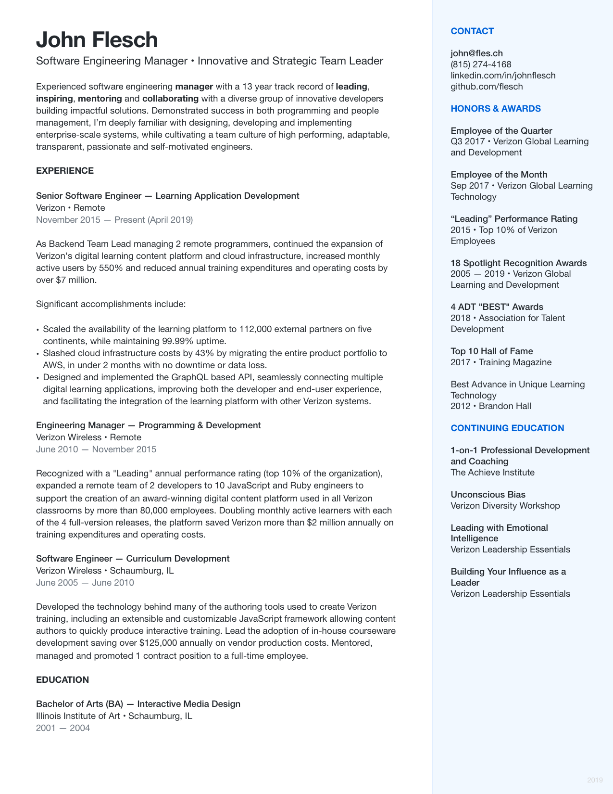

   
   
   

  

    
  

  <h1 align="center">👋&nbsp;&nbsp;Hello! I'm John Flesch</h1>
  

    Software Engineering Manager • Innovative and Strategic Team Leader
  

   
  

    <a href="mailto:john@fles.ch">john@fles.ch</a> • <a href="https://www.linkedin.com/in/johnflesch/">linkedin.com/in/johnflesch</a> • <a href="https://github.com/flesch">github.com/flesch</a>
  

   
  

    I'm an experienced software engineering manager with a proven track record
    of over 13 years of leading, inspiring, mentoring and collaborating with a
    diverse group of developers building innovative and impactful applications.
    With a strong programming background and experience in people management,
    I'm intimately familiar with all aspects in designing, developing and
    implementing enterprise-scale systems, while cultivating a team culture of
    high performing, passionate and self-motivated engineers.
  

   
  
🎯

   
   
  

    
  

